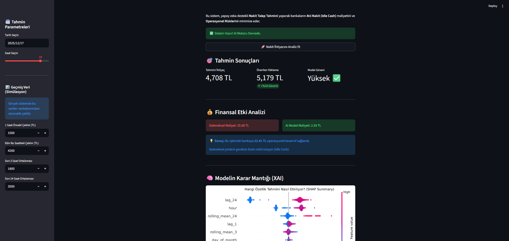

# 🏧 ATM Nakit Akış Optimizasyonu (Cash Flow Optimization)


## 📸 Uygulama Önizleme
> *Geliştirilen yapay zeka destekli karar destek sisteminin arayüzü:*



---

## 📌 Yönetici Özeti (Executive Summary)
Bu proje, bankacılık sektöründe en kritik operasyonel maliyet kalemlerinden biri olan **ATM Nakit Yönetimi** problemini çözmek amacıyla geliştirilmiştir. Gelişmiş makine öğrenmesi (Time Series Forecasting) teknikleri kullanılarak, her bir ATM'nin nakit ihtiyacı saatlik bazda %95 güven aralığı ile tahmin edilmektedir.

**Çözülen İş Problemleri:**
1.  **Atıl Nakit (Idle Cash):** ATM'lerde ihtiyaç fazlası bekleyen paranın yarattığı faiz/fırsat maliyetini minimize etmek.
2.  **Operasyonel Risk (Stockout):** Nakdin beklenmedik şekilde tükenmesi sonucu oluşan müşteri memnuniyetsizliği ve acil ikmal (CIT) maliyetlerini önlemek.

**Hedeflenen Etki:**
Model simülasyonlarına göre, geleneksel "sabit yükleme" yöntemine kıyasla bankanın nakit operasyon maliyetlerinde **%15-%20 arasında tasarruf** sağlanmaktadır.

---

## 🚀 Temel Özellikler
Proje, sadece bir modelleme çalışması değil, uçtan uca bir **MLOps** döngüsü olarak tasarlanmıştır:

* **🤖 Uçtan Uca ML Pipeline:** `src/pipeline.py` scripti ile veri okuma, temizleme, özellik mühendisliği (Feature Engineering), model eğitimi ve sürümleme süreçleri tam otomatize edilmiştir.
* **⚠️ Drift Detection (Veri Kayması Tespiti):** Kullanıcı, modelin eğitim dağılımının dışında (anormal) bir değer girdiğinde sistem otomatik olarak güven uyarısı verir.
* **📊 Canlı Monitoring:** Yapılan tüm tahminler, girdi parametreleri ve hesaplanan finansal tasarruf miktarı `monitoring.db` (SQLite) veritabanında loglanır ve arayüzde raporlanır.
* **🧠 XAI (Açıklanabilir Yapay Zeka):** SHAP (SHapley Additive exPlanations) analizi entegrasyonu ile modelin kararlarının şeffaflığı sağlanmıştır (Örn: "Dün çekilen para miktarı tahmini %40 artırdı").
* **💰 Business Logic & Simülasyon:** Model çıktılarına dinamik "Güvenlik Marjı" (Safety Margin) eklenerek operasyonel risk minimize edilir ve finansal kâr/zarar analizi gerçek zamanlı sunulur.

---

## 📂 Proje Yapısı (Repository Structure)
Profesyonel yazılım geliştirme standartlarına uygun modüler yapı:

```text
atm-project/
├── data/                  # Ham ve İşlenmiş Veri Setleri
├── models/                # Eğitilmiş Model Dosyaları (.json)
├── notebooks/             # Deneysel Çalışmalar & Raporlama
│   ├── 1_eda.ipynb        # Keşifçi Veri Analizi
│   ├── 2_baseline.ipynb   # Baseline Model Kurulumu
│   ├── 3_feature_eng.ipynb# Özellik Çıkarımı (Lags, Rolling Windows)
│   ├── 4_optimization.ipynb # Hiperparametre Optimizasyonu
│   └── 5_evaluation.ipynb # SHAP ve Model Değerlendirme
├── src/                   # Prodüksiyon Kodları
│   ├── config.py          # Merkezi Ayar ve Konfigürasyon Dosyası
│   ├── inference.py       # Profesyonel Tahmin Motoru Sınıfı
│   └── pipeline.py        # Pipeline Otomasyon Scripti
├── app.py                 # Streamlit Web Arayüzü
├── Dockerfile             # Docker Konteyner Dosyası
├── requirements.txt       # Proje Bağımlılıkları
└── README.md              # Proje Dokümantasyonu

```

## 📝 Proje Raporu & Teknik Detaylar

**1. Problem Tanımı**
ATM ağındaki nakit talebinin zaman serisi analizi ile tahmin edilmesi ve operasyonel maliyetlerin (faiz kaybı vs. lojistik maliyet) minimize edilmesi.

**2. Baseline Süreci**
Projenin başlangıcında varsayılan parametrelerle bir XGBoost Regressor eğitilmiştir. İlk denemelerde MAE (Mean Absolute Error) skoru yaklaşık 750 TL seviyelerinde gözlemlenmiştir.

**3. Feature Engineering (Özellik Mühendisliği)**
Zaman serisi desenlerini ve mevsimselliği yakalamak için aşağıdaki özellikler türetilmiştir:

**Lag Features:** lag_1 (1 saat önceki çekim), lag_24 (Dün aynı saatteki çekim - En yüksek SHAP değerine sahip özellik).

**Rolling Windows:** rolling_mean_3 (Kısa vadeli trend) ve rolling_mean_24 (Günlük trend).

**Takvim Özellikleri:** hour, day_of_week, is_weekend (Hafta sonu etkisi).

**4. Validasyon Stratejisi**
Veri seti zaman serisi (Time Series) yapısında olduğu için rastgele karıştırma (Random Shuffle) yerine Time Series Split yöntemi kullanılmıştır. Gelecekteki verinin geçmişi eğitmemesi (Data Leakage'ı önlemek) amacıyla veri kronolojik olarak %80 Eğitim - %20 Test şeklinde ayrılmıştır.

**5. Final Model ve Optimizasyon**
RandomizedSearchCV kullanılarak n_estimators, max_depth ve learning_rate gibi hiperparametreler optimize edilmiştir. Final model, Baseline modele göre RMSE skorunda belirgin bir iyileşme sağlamıştır.

**6. Canlıya Alma (Deployment) ve İzleme**

Proje Streamlit ile interaktif bir web uygulamasına dönüştürülmüştür.

Konfigürasyon: Tüm path ve parametreler src/config.py üzerinden yönetilmektedir.

Veritabanı: Her işlem monitoring.db üzerinde kayıt altına alınarak model performansı izlenebilir hale getirilmiştir.

## 🛠️ Kurulum (Local Setup)
Projeyi kendi bilgisayarınızda çalıştırmak için aşağıdaki adımları izleyin:

**1. Repoyu Klonlayın:**

```
git clone [atm-cash-optimization](https://github.com/alperaycoker/atm-cash-optimization)
cd atm-project
```

**2. Sanal Ortam Oluşturun (Opsiyonel ama önerilir):**

```python -m venv venv```
# Windows için:
```venv\Scripts\activate```
# Mac/Linux için:
```source venv/bin/activate```

**3. Gereksinimleri Yükleyin:**
```pip install -r requirements.txt```

**4. Modeli Eğitin (Pipeline):**
***Veriyi işler, modeli eğitir ve models/ klasörüne kaydeder***
```python src/pipeline.py```

**5. Uygulamayı Başlatın:**
```streamlit run app.py```

## 🐳 Docker ile Çalıştırma

Proje Dockerize edilmiştir. Herhangi bir Python kurulumu yapmadan konteyner içinde çalıştırmak için:

**1. İmajı Oluşturun:**

```docker build -t atm-app .```

**2. Konteyneri Başlatın:**

```docker run -p 8501:8501 atm-app```

**👥 İletişim**

Geliştirici: Alp Eray

GitHub: [Profilim](https://github.com/alperaycoker)

LinkedIn: [Profilim](https://linkedin.com/in/alperaycoker)
